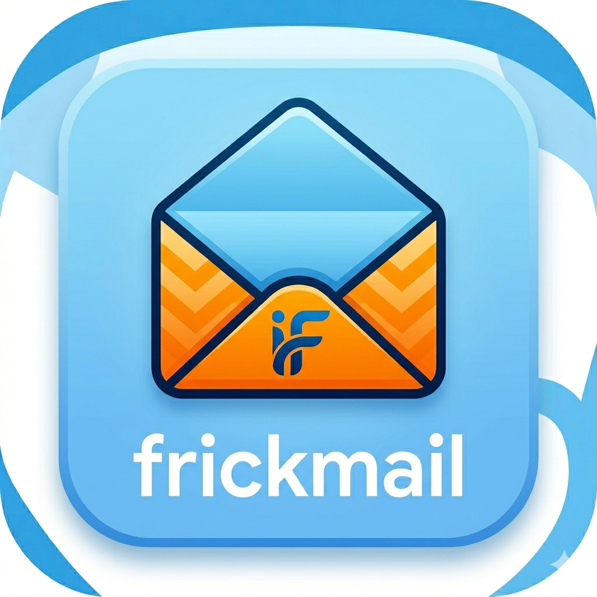

<div align="center">
  
  <h1>Frickmail</h1>
  <p>Self-hosted webmail, now migrating to a full Rust backend and Frickmail-owned runtime.</p>
  <p>
    <a href="docs/OAUTH2.md">OAuth2 setup</a> •
    <a href="docs/DEPLOYMENT.md">Build and deployment</a> •
    <a href="SECURITY.md">Security policy</a> •
    <a href="docker-compose.frickmail.yml">Compatibility Compose</a> •
    <a href="docker-compose.rust-production.yml">Rust production Compose</a>
  </p>
</div>

---

## Rust rewrite

Frickmail is moving to a full Rust backend. The existing PHP runtime is a
temporary compatibility bridge while the Rust server takes over Frickmail
identity, account management, OIDC/OAuth, IMAP/SMTP, MIME, search, tasks,
calendar, contacts, notifications, and S/MIME.

See [docs/RUST_MIGRATION.md](docs/RUST_MIGRATION.md) for the active plan.

## Current Frickmail features

| Plugin / change      | Adds                                                                                  |
| -------------------- | ------------------------------------------------------------------------------------- |
| `login-gmail` (mod)  | PKCE flow, env-var configuration, popup-based consent, configurable Workspace domains |
| `login-o365`  (mod)  | PKCE flow, env-var configuration, popup-based consent, configurable tenant + domains  |
| `contacts-sync`      | Imports contacts from Google People API / Microsoft Graph into the local PAB          |
| `calendar`           | Embedded month-view calendar with create/edit/delete against Google / Graph events    |
| `Use password` button| Lets a user bypass OAuth for one login attempt and use an IMAP app-password instead   |
| Docker image         | Bundles all the above and seeds them on first boot, ready-to-deploy                   |
| Re-branding          | UI title, admin panel and About page rebranded to Frickmail                           |

OAuth2 is the headline feature: end users only type their email, the
provider's consent screen opens in a popup, and they're signed in —
exactly like Thunderbird does it. See **[docs/OAUTH2.md](docs/OAUTH2.md)**
for app-registration steps, including the case where the user does not
have access to a tenant administrator.

## Quick start (Docker)

```bash
docker compose -f docker-compose.frickmail.yml up -d
```

- Webmail: <http://localhost:8888/>
- Admin:   <http://localhost:8888/?admin>
- Admin password (created on first boot):
  ```bash
  docker exec frickmail sh -lc 'find /var/lib -name admin_password.txt -print -quit | xargs cat'
  ```

For OAuth2 you need a public HTTPS URL. Put Frickmail behind Caddy /
Traefik / nginx with Let's Encrypt and register
`https://your-domain/?LoginGMail` and `https://your-domain/?LoginO365` as
the redirect URIs in your Google Cloud / Azure registrations.

## Rust development

Rust development must run through the Docker dev container, not host tooling:

```bash
docker compose -f docker-compose.rust.yml run --rm rust-dev cargo check --workspace
docker compose -f docker-compose.rust.yml run --rm rust-dev cargo test --workspace
```

## Building the production images

The current Docker image is still the compatibility runtime used while the Rust
rewrite progresses:

```bash
docker build -f .docker/release/Dockerfile -t frickmail:latest .
```

The production Rust server image and its canary-safe Compose service are built
with:

```bash
docker build -f .docker/release/rust/Dockerfile -t frickmail-rust:latest .
docker compose -f docker-compose.rust-production.yml up -d --no-build
```

The Rust image is suitable for production validation and an eventual traffic
cutover, but the current Rust browser root is still a migration shell and not
the complete webmail UI. Do not replace the compatibility container until the
readiness gates in the deployment guide pass.

See **[Build and deployment](docs/DEPLOYMENT.md)** for backup, isolated smoke
test, rollout, verification, and rollback instructions.

## License

Frickmail is licensed under **GNU AGPL v3**.

- Copyright © 2026 Frickmail (Frickmail-specific code)

See [LICENSE](LICENSE) and retained source-file notices for compatibility
runtime attribution.

## Security

See [SECURITY.md](SECURITY.md) for the policy.
